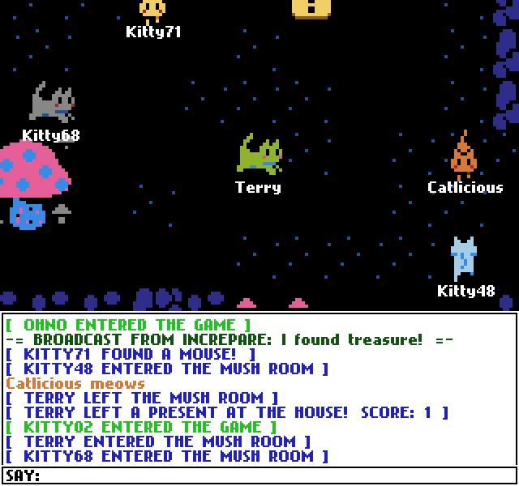

# Chatchat

ChatChat is a game about being a cat, and talking to other cats! The source code for my little 2012 multiplayer catroom game, co-created with Hayden Scott-Baron (@docky).

Chatchat is a simple multiplayer chatroom game we made in 2012. You join a server, control a cat, and talk to other cats! It has a couple of little secrets to find, but it was intentionally made to be a pretty simple game. You can, for now, play this on Kongregate here: 

[Play ChatChat on Kongregate](http://www.kongregate.com/games/TerryCavanagh_B/chatchat)

With flash reaching EOL at the end of this year, it will soon no longer be possible to play this - so somebody by email asked if I'd be willing to make the source of this little game available, and I figured: sure, why not? Here it is. This repo includes both the actionscript client code, and the c# server code which requires the player.io library - which is, uh, possibly not available anywhere anymore, I'm not sure. I think they got bought by yahoo or something.

## About the source code

The source code for this game was never meant to be made public, and it's a total mess. Chatchat actually started out as a totally different game idea - "KittyRPG" - a multiplayer puzzle thing I was making for a Ludum Dare game jam. That idea wasn't going anywhere, so I pivoted to the cat chatroom thing instead, which was way better. The code is fun of references to that old project, though. Also worth noting: this game is how I taught myself to do multiplayer code for the first time, so it's obviously a mess from that perspective too. Basically, don't try to learn anything from this!